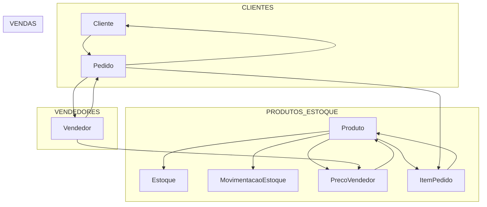

Banco de dados
## 🗄️ Estrutura do Banco de Dados (Prisma Schema)

O projeto utiliza **Prisma ORM** com **SQLite** para gerenciar a persistência de dados. A arquitetura foi desenhada focando em segurança de margem de lucro e rastreabilidade de estoque.

### Principais Entidades

*   **Produtos**: Armazena o `precoCusto` e um `precoMinimo` (trava de segurança).
*   **Vendedores**: Possuem uma `PrecoVendedor` (tabela de markup), onde é definida a margem de lucro individual para cada produto.
*   **Clientes**: Cadastro completo de compradores vinculados aos pedidos.
*   **Estoque**: Controle de saldo e histórico de movimentações (Entradas/Saídas).
*   **Pedidos/Itens**: Registra a transação "congelando" os valores de custo e venda no ato da compra para auditoria futura.

### Lógica de Cálculo de Preço
O preço de venda é calculado dinamicamente no backend seguindo a regra:
> `Preço Final = Máximo( (Custo * (1 + Margem)), Preço Mínimo )`

---

### Schema Completo
